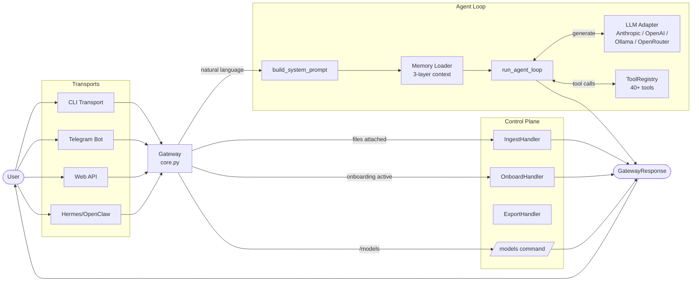
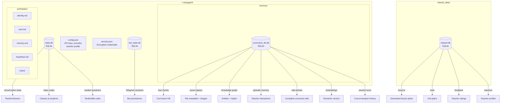
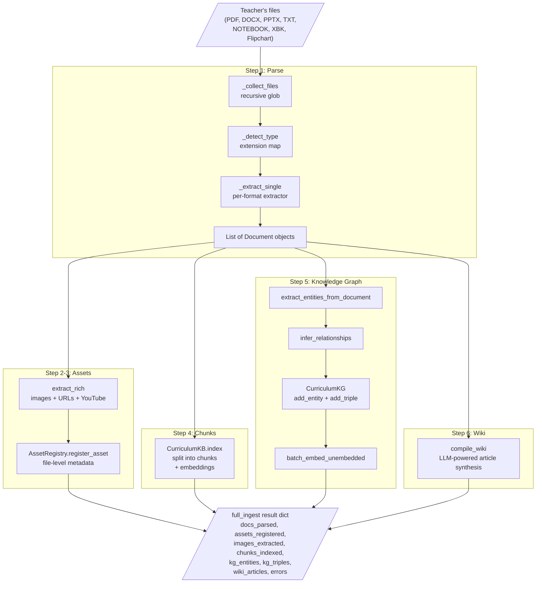
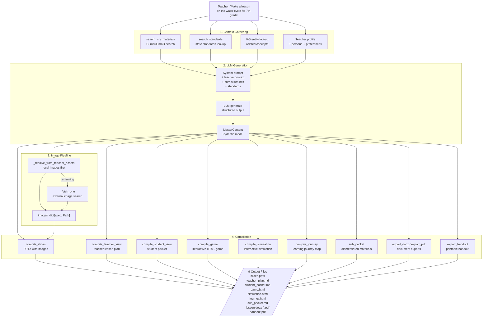

# Claw-ED Architecture Diagrams

Visual reference for the core systems. All diagrams use Mermaid syntax.

---

## 1. Message Flow

How a user message travels from transport to response.

---

## 2. Data Storage

Which databases store what, and where they live on disk.

---

## 3. Ingestion Pipeline

The `full_ingest()` path from raw files to searchable knowledge.

---

## 4. Lesson Generation Pipeline

From a teacher request to the 9 compiled output files.

